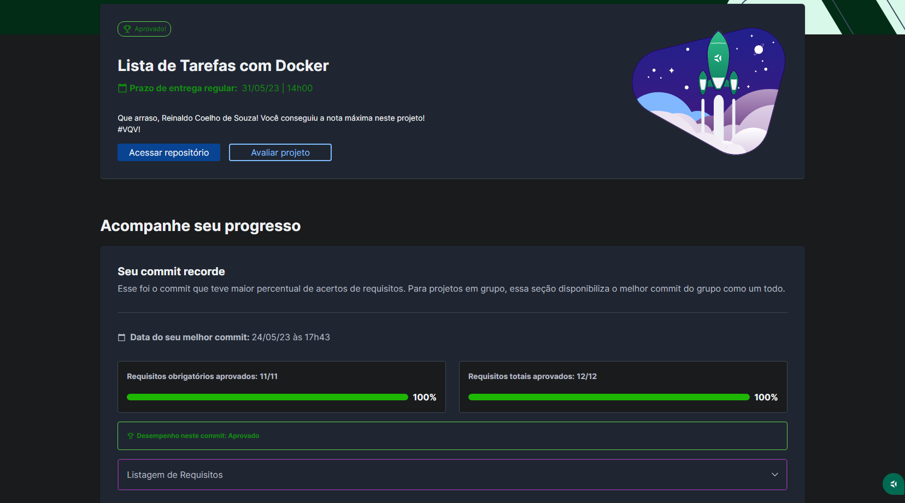

# 🐳 Docker To-Do List

## 📘 Sobre

Criei containers para várias aplicações e estabeleci conexões entre elas, orquestrando tudo com o uso do docker-compose.

## ⚛️ Ferramentas

Projeto construído utilizando React.js.

- Docker;

## 🛠️ Como executar o projeto?

`docker-compose up`

## ©️ Copyright

- Os arquivos Dockerfile, docker-compose.yml e a pasta docker-commands foram desenvolvidos por mim por mim, todo o resto é de autoria da Trybe.
